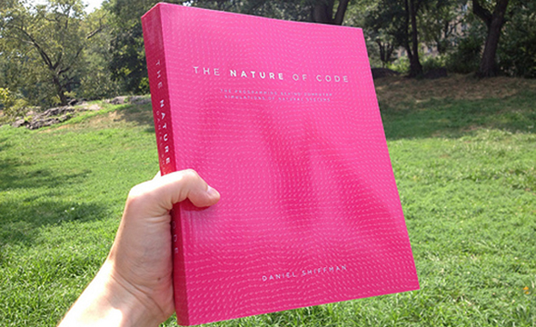

Nature of Code / openFrameworks
===============================
Concepts and ideas from Daniel Shiffman's amazing book, written in openFrameworks (0.8.4).

[Buy the book](http://natureofcode.com/) or [read it online](http://natureofcode.com/).

Is this repo a port of the examples to oF?
------------------------------------------
Not really. Shiffman has made available [code examples for each chapter](https://github.com/shiffman/The-Nature-of-Code-Examples), written in Processing. A [couple of people](https://github.com/firmread/NatureOfCode) have made [partial ports](https://github.com/emmanuelgeoffray/The-Nature-of-Code) of that repo to openFrameworks.

This repo isn't another port, though in some ways it's similar.

What is it then?
----------------
This repo is my response to reading the book - study notes and experiments. It's just that I published my scrapbook in case it helps anyone.

How to use this repo
--------------------
The root folder contains commented Java files from each chapter of the book, demonstrating salient points and listing the algorithms. In the folder [of084/apps/experiments](of084/apps/experiments) you will find the algorithms converted to openFrameworks and riddled with my experimentation.

Because openFrameworks forces you to use a certain directory structure, I just included the entire openFrameworks 0.8.4 distribution in my repo. You should be able to easily clone the repo and launch the examples, if you own a Mac with Xcode anyway.

Tested with Xcode 6.0.1.

Note on submodules
------------------
This repo uses [git submodules](http://git-scm.com/book/en/v2/Git-Tools-Submodules) to refer to addon dependencies. You can read about them, or if you just wanted to get running quickly, use:

    git clone --recursive https://github.com/microcosm/natureOfCode.git

...and you will get everything you need to start.